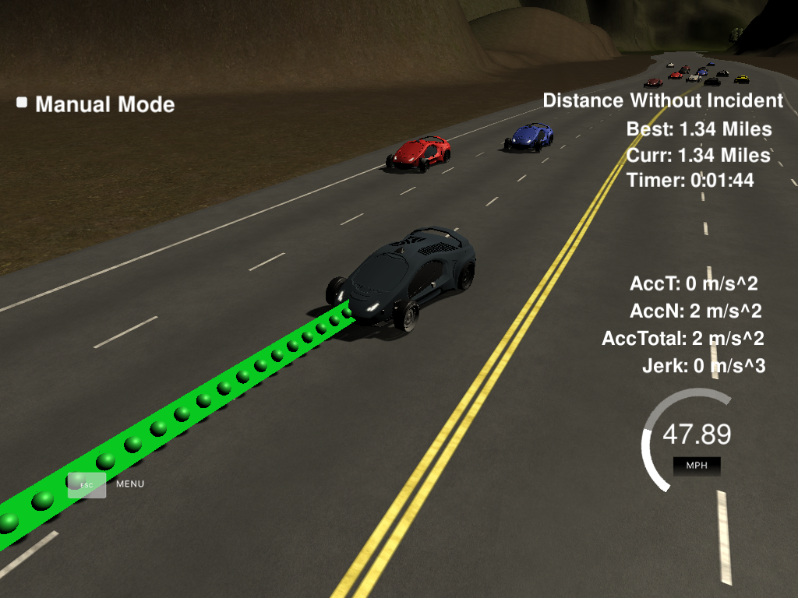

# Path Planning Project

The following is a solution for [Path Planning Project](https://github.com/udacity/CarND-Path-Planning-Project) from Term 3 of Udacity's Self Driving Car Nanodegree Program. Refer to the main repository for compilation and testing instructions.

## Description

The path planning system can be separated into two main sections. The first one is responsible for making high level decisions based on positions of other cars on the road. Its output - target lane and velocity - is then used by the trajectory generation code to ensure compliance with physical limitations imposed on the vehicle.

### Decision making

The following rule-based system has been used:
1. If we are during a lane change, keep doing that
2. Go to center lane if it's free to drive
3. Otherwise, stay on current lane if there's no vehicle in front
4. If there is a vehicle, switch to an adjacent lane if possible
5. If not, slow down to match the speed of the other car

### Trajectory generation

The trajectory has to satisfy certain constraints on permissible linear accelerations and jerk values. To achieve a smooth path during both regular driving and lane change, a spline-based waypoint approximation has been used. Speed of the vehicle changes linearly (instead of instantly) if it doesn't match the setpoint.
